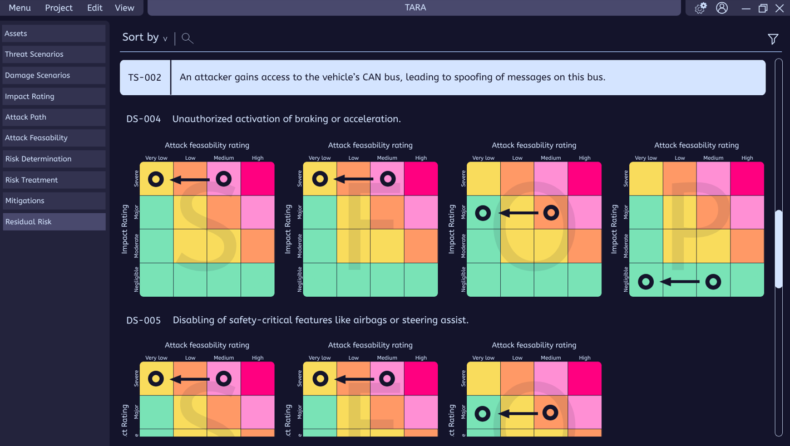

# Sentinel - TARA UI Tool

## Why this project?

As an automotive cybersecurity architect, I'm transitioning towards **modern C++/Qt software development**.

This project serves both as:
- A **technical learning journey** (C++, Qt, tooling, best pratices)
- A **prototype** of a practical tool for TARA analysts

---

**Status:** In Design Phase  

--- 

A detailed presentation of the project vision, UI mockups, and roadmap is available here: [Project Deck](assets/Sentinel_Deck.pdf)

## Project Goal

Design and implement a modern, intuitive desktop application to assist with **TARA (Threat Analysis and Risk Assessment)** in the automotive cybersecurity domain (ISO 21434).

The application allows users to **visually create embedded system architectures** using predefined components (UDS, JTAG ports, HSM, etc.) and automatically generates a **preliminary risk analysis**.

It aims to simplify the TARA process with a cleaner interface than legacy tools like Medini, and supports further expert validation and iteration.

## Current Progress

- [x] Requirements
- [x] UI Design
- [ ] SW Architecture
- [ ] Core application implementation
- [ ] Core Qt UI implementation
- [ ] Reporting & export
- [ ] Account management
- [ ] Optional AI assistant (later stage)
